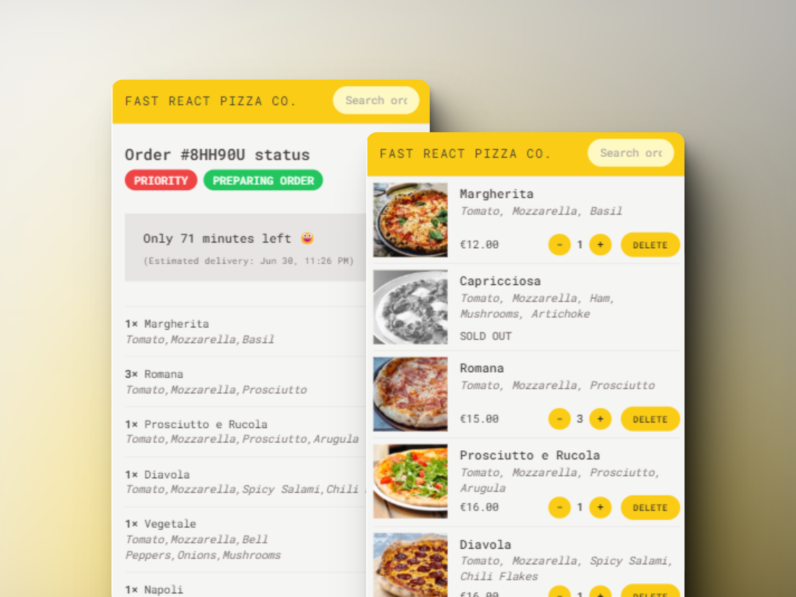

# Fast React Pizza Co.

This is a React project developed using [Create React App](https://github.com/facebook/create-react-app) as part of '[The Ultimate React Course 2024](https://www.udemy.com/course/the-ultimate-react-course/)' by Jonas Schmedtmann.

## What I learned

In this project, I build a pizza ordering web app covering topics such as:

- Redux
- Creating a Reducer and Redux Store
- Working with Action Creators
- State Slices
- Connecting Redux App with React
- Dispatching Actions
- Redux Middleware and Thunks
- Making an API Call with Redux Thunks
- Redux DevTools
- Redux Toolkit (RTK) and Creating Store with RTK
- Creating Slices with RTK
- Redux vs Context API
- Fetching Data With useFetcher

### Screenshot

Here's a glimpse of the final project:



## Installation

To install the project, follow these steps:

1. Clone the repository:

```bash
git clone https://github.com/xyzeez/fast-react-pizza-co.git
```

2. Navigate to the project directory:

```bash
cd fast-react-pizza-co
```

3. Install dependencies:

```bash
npm install
```

4. Start the application:

```bash
npm run dev
```
